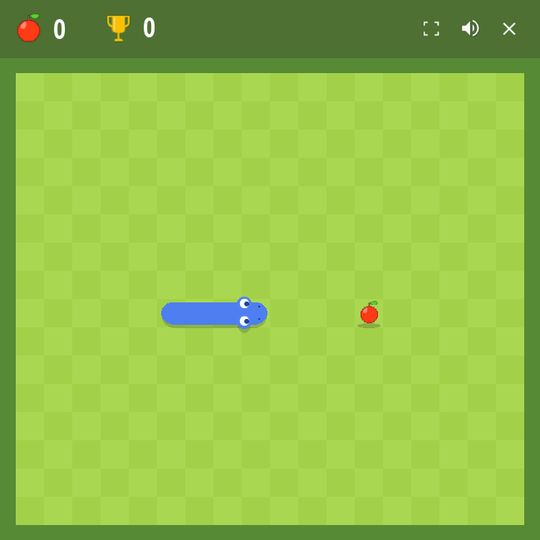

# Snake Game

[](https://github.com/heshamrabea445-lab/Snake_Game/actions/workflows/validate.yml)

A polished desktop take on Snake built with Python and Pygame, with animated UI, expressive sprite work, audio feedback, and a release-ready Windows build pipeline.


[Instant Preview](#instant-preview) • [Download Windows Build](https://github.com/heshamrabea445-lab/Snake_Game/releases/latest) • [Run Locally](#run-locally)

## Instant Preview

The GIF above is the no-download version of the project: you can see the current gameplay, UI, and feel of the game directly from the repository page.

If you want to play the full desktop version, download the latest Windows release or run it locally with Python.

## Why This Project Stands Out

- Smooth animated starter card flow instead of a bare launch screen
- Polished snake presentation with mouth, tongue, eye, death, and collision effects
- Audio feedback for turns and collisions
- Deferred asset loading for a faster-feeling startup
- Freeze-ready asset loading so the same code works locally and in a packaged Windows build
- Automated validation and Windows release packaging through GitHub Actions

## Screenshots




## Controls

| Action | Keys |
| --- | --- |
| Move | Arrow keys or `WASD` |
| Start from waiting screen | Any direction key |
| Start from launch card | `R` or click Play |
| Restart after death | `R` or click Play |
| Toggle fullscreen | `F` |
| Toggle mute | Click volume icon |
| Quit | `Esc` or click `X` |

## Run Locally

### Requirements

- Python 3.13
- `pip`
- A desktop environment that can open a Pygame window

### Install

If your interpreter is already set to Python 3.13, you can run the game without creating a virtual environment:

```bash
python -m pip install --upgrade pip
pip install -r requirements.txt
```

### Start the game

```bash
python main.py
```

### Optional: use a virtual environment

Windows:

```bash
python -m venv .venv
.venv\Scripts\activate
python -m pip install --upgrade pip
pip install -r requirements.txt
```

macOS / Linux:

```bash
python -m venv .venv
source .venv/bin/activate
python -m pip install --upgrade pip
pip install -r requirements.txt
```

## Download the Windows Build

The Windows release is distributed as a ZIP bundle through GitHub Releases.

1. Open the [latest release](https://github.com/heshamrabea445-lab/Snake_Game/releases/latest)
2. Download `snake-game-windows.zip`
3. Extract the ZIP
4. Launch `Snake.exe`

## Technical Highlights

- Single-file game architecture with structured helper sections for startup, assets, input, animation, and rendering
- Packaged asset loading that supports both source execution and frozen builds
- Headless smoke test coverage for startup and deferred asset loading
- GitHub Actions workflows for validation and Windows release packaging
- One-folder PyInstaller build for a more reliable Windows distribution

## Repository Layout

```text
Snake_Game/
├── audio/                  # Sound effects and music assets
├── images/                 # UI and board image assets
├── media/                  # README GIF and screenshots
├── scripts/                # Validation utilities
├── sprites/                # Character and effect sprite sheets
├── .github/workflows/      # CI and release automation
├── main.py                 # Game entry point
├── requirements.txt        # Runtime dependency
└── snake_game.spec         # Windows packaging definition
```

## Validation

To run the lightweight local validation pass:

```bash
python -m py_compile main.py
python scripts/smoke_test.py
```

## License

This project is licensed under the MIT License. See [LICENSE](LICENSE).
