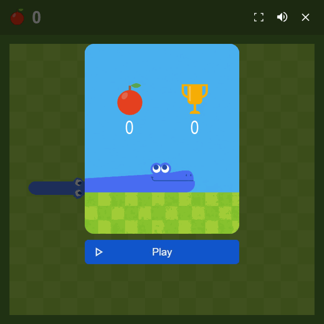
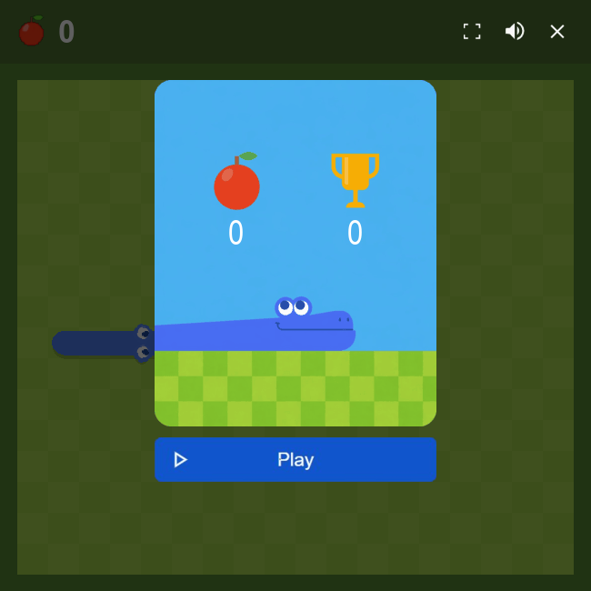
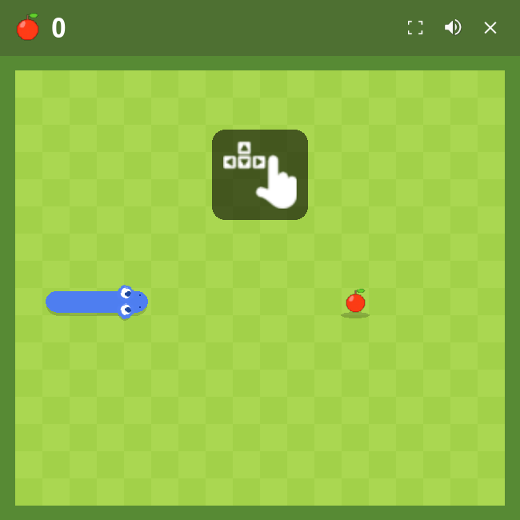

# Snake Game

[](https://github.com/heshamrabea445-lab/Snake_Game/actions/workflows/validate.yml)

A polished Snake game built with Python and Pygame, with a matching browser version published through GitHub Pages.



[Play in Browser](https://heshamrabea445-lab.github.io/Snake_Game/) | [Download Windows Build](https://github.com/heshamrabea445-lab/Snake_Game/releases/latest) | [Run From Source](#run-from-source)

## Highlights

- Smooth continuous movement with buffered turns
- Animated starter card, waiting cue, death, and collision effects
- Turn, eat, and collision audio feedback
- Desktop Pygame version plus a browser version in `docs/`
- GitHub Actions validation and Windows release packaging

## Screenshots





## Controls

| Action | Keys / UI |
| --- | --- |
| Move | Arrow keys or `WASD` |
| Start from waiting screen | Any direction key |
| Start from launch card | `R` or click Play |
| Restart after death | `R` or click Play |
| Toggle desktop fullscreen | `F` |
| Toggle mute | Click volume icon |
| Quit desktop game | `Esc` or click `X` |

## Run From Source

### Requirements

- Python 3.13+
- `pip`
- A desktop environment that can open a Pygame window

### Install dependencies

```bash
python -m pip install --upgrade pip
pip install -r requirements.txt
```

### Start the game

```bash
python main.py
```

## Browser Version

The browser build is published with GitHub Pages and lives in `docs/`.

- Live site: [heshamrabea445-lab.github.io/Snake_Game](https://heshamrabea445-lab.github.io/Snake_Game/)
- Local entry: `docs/index.html`

## Download the Windows Build

The Windows ZIP is the easiest way to play on Windows.

1. Open the [latest release](https://github.com/heshamrabea445-lab/Snake_Game/releases/latest)
2. Download `snake-game-windows.zip`
3. Extract the ZIP
4. Open the extracted `Snake_Game` folder
5. Launch `Snake Game.exe`, or run `Install Shortcuts.ps1`

## Repository Layout

```text
Snake_Game/
|-- audio/
|-- docs/
|-- snake_game/
|-- images/
|-- media/
|-- scripts/
|-- sprites/
|-- .github/workflows/
|-- main.py
|-- requirements.txt
`-- snake_game.spec
```

## Validation

```bash
python -m py_compile main.py
python scripts/smoke_test.py
```

## License

This project is licensed under the MIT License. See [LICENSE](LICENSE).
